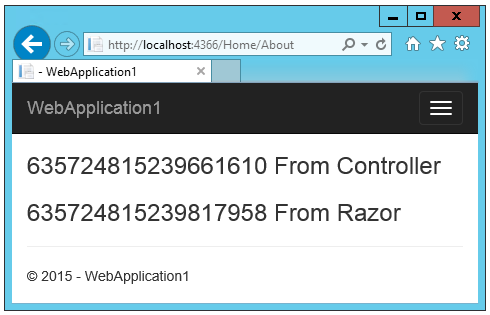

DI in MVC 6
======================================================

By `Rick Anderson`_ and `Steve Smith`_

In this article:
	- `The Dependency Injection Design Pattern`_
	- `Definitions`_
	- `Using EF in ASP.NET MVC 5 without DI`_
	- `DI in ASP.NET MVC 6 ( MVC 6, Web API, SignalR, Razor and Web Pages )`_
	- `The ASP.NET MVC 6 DI system`_
	- `Service Registration`_
	- `Constructor injection`_
	- `Use Interfaces to expose services`_
	- `Service component lifetime`_
	- `The FromServices attribute`_
	- `Controllers and the Activate pattern`_
	- `Using the Activate attribute in controllers`_
	- `Tag helpers and the activate pattern`_
	- `Activate (property injection) v constructor injection`_
	- `@inject and displaying razor compilations`_

Dependency Injection (DI) is a software design pattern, a particular case of the Inversion of Control (IoC). IoC means that objects do not create other objects on which they rely to do their work. Instead, they get the objects that they need from an outside source (for example, a configuration file or a container where the objects are registered). DI means that this is done without the object intervention, usually by a framework component that passes constructor parameters or sets properties.  DI is independent of the Model-View-Controller (MVC) architectural pattern, although the MVC pattern works well with DI. I'll show an example of DI later in the tutorial.

The Dependency Injection Design Pattern 
^^^^^^^^^^^^^^^^^^^^^^^^^^^^^^^^^^^^^^^^^^^^^^^^^^^^^^^^^

At a high level, the goal of DI is that a client class (for example, an order searching app) needs something that satisfies an interface (for example,  `ISearch` ). It doesn't care what the concrete type is (that is, `SearchDB, SearchMemory, SearchXML`, etc.), it wants someone else to handle that. 

DI and IoC provide the following benefits:

- Reduced class coupling, which makes code more easily maintained, updated, refactored and reused. It also enables parallel development. 
- Enables services to be available to components. 
- Enables highly testable code using unit tests and functional tests. 
- Reliably supports multiple deployment configurations (test, development, production, beta production, etc.). 
- Control of the lifetime of objects. 
- Simplifies cross-cutting concerns such as logging and exception handling.
 
For a detailed discussion of DI benefits, see this excellent `patterns & practices article <http://msdn.microsoft.com/en-us/library/dn178470(v=pandp.30).aspx>`_ and this `P&P's DI article <http://msdn.microsoft.com/en-us/library/dn178469(v=pandp.30).aspx#sec2>`_. See also `Inversion of Control Containers and the Dependency Injection pattern by Martin Fowler <http://www.martinfowler.com/articles/injection.html>`_. Martin Fowler coined the term Dependency Injection. You can also read more about `DI on Wikipedia <http://en.wikipedia.org/wiki/Dependency_injection>`_. 

`[EDITOR COMMENT]` The following paragraph requires sign off by Daniel Roth and Louis DeJardin.

While DI in previous versions of ASP.NET MVC was sometimes used, frequently debated and blogged about, it was non-trivial to implement, and there was little built in support for it. ASP.NET MVC 6 was architected with DI in mind, and it's available in a consistent way throughout the entire web stack. A minimalistic DI container is provided, and we currently provide `adapters <http://en.wikipedia.org/wiki/Adapter_pattern>`_ for third party DI containers (such as `AutoFac <http://autofac.org/>`_ and `Ninject <http://www.ninject.org/>`_).  These DI container adaptors are temporary and are there for reference; we expect that they will eventually be removed and replaced by the respective container owners. Additionally not all of them are fully operational. 

The default DI container is intentionally minimal, and we are not planning to take feature requests for the default implementation. It is intended to stay minimal, and support a common set of features that the framework relies on. If you have a preferred 3rd party DI system, we encourage you to use it. Third party container support is available through the  `IServiceProvider <http://msdn.microsoft.com/en-us/library/system.iserviceprovider.aspx>`__ interface which provides an abstraction over the DI container implementation. The ``IServiceProvider`` interface represents the minimal set of behaviours containers must honor. All ASP.NET MVC 6 framework components (MVC, Routing, SignalR, Entity Framework, etc.) require constructor injection and rely on the capabilities of ``IServiceProvider``.  Your own code can use any feature that your chosen DI container provides, so long as the minimum contract specified by ``IServiceProvider`` is available to the MVC framework . When you use a third party DI container, you can replace the default implementation of ``IServiceProvider`` with a wrapper around your preferred container. Once that happens, all the dependency resolution calls will be routed to your container. 

All framework components use the same DI container to register services, therefore we can now flow dependencies across the stack. This makes possible many new scenarios that were difficult or impossible before, like injecting a SignalR broadcaster into an MVC controller action. 

Definitions 
^^^^^^^^^^^^^^^^^^^^^^^^^^^^^^^^^^^^^^^^^^^^^^^^^^^^^^^^^

The IoC and DI terms below are highly overloaded and the definitions are for this document only.

- **Service**: An abstract contract (expressed as an interface) describing the functionally provided. For example an ILogger interface for a logging component. 
- **Component**: The concrete implementation of a service. For example XML_Logger, Txt_Logger, EF_Logger, Trace_Logger, Console_Logger, etc. 
- **Client Component**: The class consuming services. For example, razor pages are clients and consume an IHtmlHelper service by default. Service implementation components are also often clients of other services. (TODO for example ?? ) 
- **IoC Container**: The container that controls the lifetime (creation, disposal), configuration and dependencies of components. 
- `[EDITOR COMMENT]The next two defn's to come from Hunter/Hanselman/Galloway`
- **ASP.NET 5**: The next version of ASP.NET, the open source Microsoft platform for building Modern Web Applications on Windows, Linux and Mac. ASP.NET 5 includes the MVC 6 framework for building web applications. It combines the features of MVC, Web API and Web Pages into a single web framework. ASP.NET 5 also includes SignalR 3 for adding real time functionality to cloud connected applications. 
- **ASP.NET MVC 6**: The framework for building web apps on the ASP.NET 5 platform. It features the merged MVC, Web Pages, and Web API from the previous version of ASP.NET. 

`[EDITOR COMMENT]` Next section is just to make IoC concrete 

Using EF in ASP.NET MVC 5 without DI
^^^^^^^^^^^^^^^^^^^^^^^^^^^^^^^^^^^^^^^^^^^^^^^^^^^^^^^^^^^^^^^^^^^^^^^^^

To use Entity Framework (EF) in previous versions of ASP.NET MVC, you would typically create a model and a `DbSet <https://github.com/aspnet/EntityFramework/blob/master/src/EntityFramework/DbSet.cs>`_ for that model. For example, many of our introductory tutorials used code similar to the following.

.. code-block:: c#

	 using Microsoft.Data.Entity;

	 public class TodoItem
	 {
	   public int Id { get; set; }
	   public string Title { get; set; }
	   public bool IsDone { get; set; }
	   public int Priority { get; set; }
	 }

	 public class TodoItemDbContext : DbContext
	 {
	   public DbSet<TodoItem> TodoItems { get; set; }
	 }
	 

Typically, each controller that needed access to the database would need to create a new `TodoItemDbContext`.

.. code-block:: c#

	public class TodoController : Controller
	{
		private TodoItemDbContext db = new TodoItemDbContext();   
		public ActionResult Index()
		{
			return View(db.TodoItems.ToList());
		}
		 // Code removed for brevity.
	}

As stated previously, IoC means that objects do not create other objects on which they rely to do their work. In the code above, the controller is creating a database context. The Todo controller is dependent on the EF `TodoItemDbContext`, and each controller which requires access to the database needs to call the `TodoItemDbContext` constructor. The Todo controller is in control of creating the `TodoItemDbContext` object. Additionally, the Separation of Concerns (SoC) mantra is violated as the controller needs to know how to create a specific data access object. The EF dependency is tightly coupled with each controller. A real app could have many controllers with each controller creating a database context.

DI in ASP.NET MVC 6 ( MVC 6, Web API, SignalR, Razor and Web Pages ) 
^^^^^^^^^^^^^^^^^^^^^^^^^^^^^^^^^^^^^^^^^^^^^^^^^^^^^^^^^^^^^^^^^^^^^^^^^

In previous versions of ASP.NET MVC, if you wanted controllers to support DI, you had to register your controllers with the DI framework. In ASP.NET MVC 6, DI is built into the framework and you no longer have to register controllers for DI. DI is throughout the entire web stack framework. You can get access to services in filters, middle ware (including authentication), model binding, formatters, and virtually any part of the pipeline where you want to use your services.

To move the previous sample to ASP.NET MVC 6, the TodoItem model doesn't change. To use DI, register `TodoItemDbContext` in the `ConfigureServices method` (in the *Startup.cs* file).

.. code-block:: c#

	public void ConfigureServices(IServiceCollection services)
	{
		// Add EF services to the services container.
		services.AddEntityFramework(Configuration)
			.AddSqlServer()
			.AddDbContext<TodoItemDbContext>();

		services.AddMvc();
	}
	
The following shows the controller using constructor injection of the TodoItemDbContext.

.. code-block:: c#

	public class TodoController : Controller
	{
		public TodoItemDbContext db;

		public TodoController(TodoItemDbContext context)
		{
			db = context;
		}

		// Code removed for brevity.
	}
	
The following shows the controller using the `FromServices <https://github.com/aspnet/Mvc/blob/dev/src/Microsoft.AspNet.Mvc.Core/FromServicesAttribute.cs>`_ attribute to inject the TodoItemDbContext.

.. code-block:: c#

	public class TodoController : Controller
	{
		[FromServices]
		public TodoItemDbContext db { get; set; };
		
		// Code removed for brevity.
	}
	
The controller no longer depends on creating the `TodoItemDbContext`,  the controller and EF are now loosely coupled. The controller is no longer in control of creating `TodoItemDbContext`, we have inverted the control of the database access component (and achieved IoC). The database context is created in one place. 

The ASP.NET MVC 6 DI system
^^^^^^^^^^^^^^^^^^^^^^^^^^^^^^^^^^^^^^^^^^^^^^^^^^^^^^^^^^^^^^^^^^^^^^^^^
The DI system was designed to accomplish the following goals:

- Easy integration with 3rd party DI systems. 
- Allow services to flow across frameworks.  Prior to ASP.NET MVC 6, there was no way to get SignalR's broadcaster into a MVC or Web API  action. ASP.NET MVC 6 makes that just work by default. Simply register SignalR and MVC 6 with the extension methods `AddSignalR <https://github.com/aspnet/SignalR-Server/blob/master/src/Microsoft.AspNet.SignalR.Server/SignalRServiceCollectionExtensions.cs>`_ and `AddMvc <https://github.com/aspnet/Mvc/blob/master/src/Microsoft.AspNet.Mvc/MvcServiceCollectionExtensions.cs#L11-L35>`__ , and services are freely flowing between the two systems. (ASP.NET MVC and Web API are now one system called ASP.NET MVC 6.)  Now your application can publish from middleware and a controller action and arbitrary class activated with `TypeActivator <https://github.com/aspnet/DependencyInjection/blob/master/src/Microsoft.Framework.DependencyInjection/TypeActivator.cs>`_ are available to the DI system. Cross cutting concerns (for example logging) can be set in one place and used across the entire web stack. 

Service Registration 
^^^^^^^^^^^^^^^^^^^^^^^^^^^^^^^^^^^^^^^^^^^^^^^^^^^^^^^^^^^^^^^^^^^^^^^^^
Services are registered in the `Startup` class, using the overloads of `ConfigureServices`. The ASP.NET runtime instantiates the `StartupLoader <https://github.com/aspnet/Hosting/blob/master/src/Microsoft.AspNet.Hosting/Startup/StartupLoader.cs>`_ class which searches for the `Startup` class and invokes `ConfigureServices` and then `Configure` to create the pipeline. The `ConfigureServices` method has an `IServiceCollection <https://github.com/aspnet/DependencyInjection/blob/master/src/Microsoft.Framework.DependencyInjection/IServiceCollection.cs#L14-L30>`_ parameter, which exposes the service container. You add services in the `ConfigureServices` method when you need to explicitly register a service with the DI system. DI registration has to be completed before services can be consumed. The `Configure` method is called after `ConfigureServices` and is used to configure middleware. 

Create a new **ASP.NET 5  Web Application**. Keep the default name *WebApplication1* for the project so the namespace will match the rest of the tutorial. If you've already created a *WebApplication1* project, create the project in a new folder so you can use *WebApplication1* again. Select the **Change Authentication** button and click **No Authentication**. Examine the generated `Startup` class. 

.. code-block:: c#
	
	  // This method gets called by the runtime.
	  public void ConfigureServices(IServiceCollection services)
	  {
		// Add MVC services to the services container.
		services.AddMvc();
	  }
	
`AddMvc <https://github.com/aspnet/Mvc/blob/master/src/Microsoft.AspNet.Mvc/MvcServiceCollectionExtensions.cs#L33-L40>`_ is an extension method to make it easier to register ASP.NET MVC and add it to the DI container.

Avoid replacing services - prefer extensibility points
^^^^^^^^^^^^^^^^^^^^^^^^^^^^^^^^^^^^^^^^^^^^^^^^^^^^^^^^^^^^^^^^^^^^^^^^^

A common complaint of developers who've used previous version of ASP.NET is that they can't easily customize the view engine or the controller selector. The MVC 6 approach to replacing services by using extensibility points involves far less complexity and risk. In the past it was common to replace the view engine location, we now recommend you use `IViewLocationExpander <https://github.com/aspnet/Mvc/blob/master/src/Microsoft.AspNet.Mvc.Razor/IViewLocationExpander.cs>`_. We have provided the `LanguageViewLocationExpander <https://github.com/aspnet/Mvc/blob/master/test/WebSites/RazorWebSite/Services/LanguageViewLocationExpander.cs>`_ sample which provides support to customize the view engine to support languages.

Avoid the Service Locator Pattern - prefer constructor injection
^^^^^^^^^^^^^^^^^^^^^^^^^^^^^^^^^^^^^^^^^^^^^^^^^^^^^^^^^^^^^^^^^^^^^^^^^
Developers using previous versions of ASP.NET MVC and Web API frequently used the `Service Locator Pattern <http://msdn.microsoft.com/en-us/library/ff648968.aspx>`_ (SLP) to replace services. With ASP.NET MVC 6 we recommend your client components use constructor injection instead of using `IServiceProvider <http://msdn.microsoft.com/en-us/library/system.iserviceprovider(v=vs.110).aspx>`__ directly.

Constructor injection
^^^^^^^^^^^^^^^^^^^^^^^^^^^^^^^^^^^^^^^^^^^^^^^^^^^^^^^^^^^^^^^^^^^^^^^^^
In this section we will create a simple time service and use the built in DI container to register and use the time service.

1.	In the *WebApplication1* project you created above, create a new `TimeService` class and replace it with the following:

.. code-block:: c#

	using System;
	namespace WebApplication1
	{
	  public class TimeService
	  {
		public TimeService()
		{
		  Ticks = DateTime.Now.Ticks.ToString();
		}
		public String Ticks { get; set; }
	  }
	}
	
The simple service class sets the current `Ticks <http://msdn.microsoft.com/en-us/library/system.datetime.ticks(v=vs.110).aspx>`_ when the constructor is called. 

2.	Update the `ConfigureServices` method in the `Startup` class to add `TimeService` to the runtime service container: 

.. code-block:: c#
   :emphasize-lines: 4

	public void ConfigureServices(IServiceCollection services)
	{  
	  services.AddMvc();
	  services.AddTransient<TimeService>();
	}

I'll explain `AddTransient` soon. 
	
3. Update the `HomeController` to use constructor injection and to write the `Ticks` when the `TimeService` object was created in the `About` action method: 

.. code-block:: c#
   :emphasize-lines: 3-7,11-12

	public class HomeController : Controller
	{
		public TimeService TimeSvc { get; set; }
		public HomeController(TimeService service)
		{
			TimeSvc = service;
		}
	   
		public IActionResult About()
		{
			ViewBag.Message = TimeSvc.Ticks + " From Controller";
			System.Threading.Thread.Sleep(1);
			return View();
		}
			// Code removed for brevity.
	   
	}
	
Notice the controller doesn't create `TimeService`, it's injected when the controller is instantiated.
	
4.	Update the `About` view to inject `TimeService` into the view using the Razor **@inject** keyword.  The injected time service will display the `Ticks` when `TimeService` is created for the view. Replace the markup in the *Views\Home\About.cshtml* razor view with the following:

.. code-block:: html

	@using WebApplication1
	@inject TimeService TimeSvc

	<h3>@ViewBag.Message</h3>

	<h3>
	  @TimeSvc.Ticks From Razor
	</h3>

	
5.	Run the app. Because we registered our service component as transient, a new component is created each time it's accessed. The controller and razor ticks are different. Refresh the page and new ticks values are displayed.

6. Replace the home controller code with the following and run the app.

.. code-block:: c#
   :emphasize-lines: 3-8
   
	public class HomeController : Controller
	{
		[FromServices]
		public TimeService TimeSvc { get; set; }
		//public HomeController(TimeService service)
		//{
		//    TimeSvc = service;
		//}

	   // Code removed for brevity.
	}

The `[FromServices] <https://github.com/aspnet/Mvc/blob/dev/src/Microsoft.AspNet.Mvc.Core/FromServicesAttribute.cs>`__ attribute binds the decorated property to the DI container. Run the app to verify you get the same behaviour. The ``[FromServices]`` attribute approach is preferred when you don't need to use constructor injection.  

Service component lifetime
^^^^^^^^^^^^^^^^^^^^^^^^^^^^^^^^^^^^^^^^^^^^^^^^^^^^^^^^
Controlling object lifetime from one place (the container) is an important benefit of DI. In the code above, ``TimeService`` was added with a lifetime `(LifecycleKind) <https://github.com/aspnet/DependencyInjection/blob/master/src/Microsoft.Framework.DependencyInjection/LifecycleKind.cs#L11-L16>`_ of Transient. The `add\<LifecycleKind\> <https://github.com/aspnet/DependencyInjection/blob/master/src/Microsoft.Framework.DependencyInjection/ServiceCollectionExtensions.cs#L10-L151>`_ extension methods are provided for the lifetime policy required.

.. list-table:: Service component lifetime
   :header-rows: 1

   * - Method	
     - Lifetime	
     - Object Creation	
     - Notes
   * - `Add <https://github.com/aspnet/DependencyInjection/blob/dev/src/Microsoft.Framework.DependencyInjection.Abstractions/ServiceCollectionExtensions.cs>`_	
     - Specified by `ServiceLifetime <https://github.com/aspnet/DependencyInjection/blob/dev/src/Microsoft.Framework.DependencyInjection.Abstractions/ServiceLifetime.cs>`_	 	
     - 
     - Most general form.
   * - `AddTransient <https://github.com/aspnet/DependencyInjection/blob/dev/src/Microsoft.Framework.DependencyInjection.Abstractions/ServiceCollectionExtensions.cs>`_
     - Many per request.	
     - A new instance is created for every location where the type is required to be injected.	
     - Most services will use this. Gets a new copy of object in controller, view, middleware, filters, etc. All the instances are disposed at the end of the response.

   * - `AddScoped <https://github.com/aspnet/DependencyInjection/blob/dev/src/Microsoft.Framework.DependencyInjection.Abstractions/ServiceCollectionExtensions.cs>`_
     - Request.	
     - A single instance is created for the first location where the type is required to be injected and this same instance is used in other locations for this request.	
     - Like transient except the same object is used throughout the pipeline for the request. Typical use includes data access via unit of work. The instance is disposed at the end of the response.

   * - `AddSingleton <https://github.com/aspnet/DependencyInjection/blob/dev/src/Microsoft.Framework.DependencyInjection.Abstractions/ServiceCollectionExtensions.cs>`_
     - App	
     - A single instance is created for the first location where the type is required to be injected and this same instance is used for the life of the app.	
     - Singleton behavior. Runtime service container creates it. Singletons generally contain per-application state. Typical use includes an ``ILogger`` implementation and `IControllerActivator <https://github.com/aspnet/Mvc/blob/master/src/Microsoft.AspNet.Mvc.Core/IControllerActivator.cs#L9-L18>`_. [TODO Check this [YG] Not sure this is still relevant].

   * - `AddInstance <https://github.com/aspnet/DependencyInjection/blob/dev/src/Microsoft.Framework.DependencyInjection.Abstractions/ServiceCollectionExtensions.cs>`_
     - App	
     - Same as ``AddSingleton``.	
     - Like singleton but you invoke the object constructor.

Use Interfaces to expose services
^^^^^^^^^^^^^^^^^^^^^^^^^^^^^^^^^^^

Interfaces are the preferred approach to exposing a service. Instances should also be exposed using interfaces. If the service method details change, you generally don't need to change your client code that uses the interface. Using an interface helps you achieve loose coupling.

Update the time service component to expose an `ITimeService` interface. You can do this automatically by selecting :menuselection:`TimeService --> right click --> Quick Actions --> Generate Interface`.

.. code-block:: c#

	using System;
	namespace WebApplication1
	{
		public class TimeService : ITimeService
		{
			public TimeService()
			{
				Ticks = DateTime.Now.Ticks.ToString();
			}
			public String Ticks { get; set; }
		}
		public interface ITimeService
		{
			string Ticks { get; set; }
		}   
	}

Transient and Scoped for request lifetime
^^^^^^^^^^^^^^^^^^^^^^^^^^^^^^^^^^^^^^^^^^

If you want to dispose of resources at the end of the each request, use ``AddScoped`` or ``AddTransient``. If you need to maintain state between multiple users of a service, use ``AddScoped``.  ``AddTransient`` will make a separate copies of the object for the controller, view, filter, everywhere the object is requested.

Using other service lifetimes
^^^^^^^^^^^^^^^^^^^^^^^^^^^^^^

Update the home controller and about view to use the ``ITimeService`` interface. 

.. code-block:: c#
   :emphasize-lines: 4

	public class HomeController : Controller
	{
		[FromServices]
		public ITimeService TimeSvc { get; set; }

	   // Code removed for brevity.

	}

.. code-block:: html
   :emphasize-lines: 2

	@using WebApplication1
	@inject ITimeService TimeSvc
   
	<h3>@ViewBag.Message</h3>
   
	<h3>
		@TimeSvc.Ticks From Razor
	</h3>

Update the ``ConfigureServices`` method in the ``Startup`` class so ``ITimeService`` is added to the service container with *scoped* or *singleton* lifetime. With scoped, a single instance is created for the first location where the type is required to be injected and the same instance is used in other locations for the request.

.. code-block:: c#
   :emphasize-lines: 4-11

		  public void ConfigureServices(IServiceCollection services)
		  {
			 services.AddMvc();
	#if Tran
			services.AddTransient<ITimeService, TimeService>();
	#elif Scoped
			services.AddScoped<ITimeService, TimeService>();
	#else
			 services.AddSingleton<ITimeService, TimeService>();
	#endif

When using *scoped*, the ``About`` view shows the same ticks value for both the controller and the view. Refresh the page and new ticks values will be displayed. When you use *singleton* lifetime,  the controller and view display the same ticks value, when you refresh, these values don't change because the service component is only created once for the life of the app.

Put a breakpoint on the line 

.. code-block:: c#
   :emphasize-lines: 1

	services.AddMvc();

And examine the results view. You'll see the lifetime, implementation and type of each registered service.

 .. image:: dependency-injection/_static/results.png
 
The FromServices attribute
^^^^^^^^^^^^^^^^^^^^^^^^^^^^^^^

See also  [FromHeader], PlainController sample 
 
Property injection with bespoke attributes
^^^^^^^^^^^^^^^^^^^^^^^^^^^^^^^^^^^^^^^^^^^^^

.. code-block:: c#

	public class MyController
	{
		[ActionContext]
		public ActionContext ActionContext { get; set; }

		public HttpContext HttpContext => ActionContext.HttpContext
	}

In classic DI, every object and service that the DI system supports is registered in the DI container. Registration can be explicit or by searching assemblies of the file system and automatically registering them. The default container currently does not support searching/auto registration, but `AutoFac <http://autofac.org/>`_ and `MEF <http://msdn.microsoft.com/en-us/library/dd460648(v=vs.110).aspx>`_ have a startup method you can call to search for a list of interfaces and services and automatically wire them up.

The `Activate <https://github.com/aspnet/Mvc/blob/master/src/Microsoft.AspNet.Mvc.Core/ActivateAttribute.cs#L12-L15>`_ attribute fits in with the MVC architectural pattern, it's not strictly an IoC or DI pattern. While the built in (default) ASP.NET MVC 6 IoC container supports the ``Activate`` attribute for property injection, ASP.NET MVC 6 does not depend on it. You can use an IoC container that doesn't support the ``Activate`` attribute, and obviously you won't be able to use the ``Activate`` attribute to inject services into that container. Note 3rd party containers such as `Autofac <http://autofac.org/>`_  do not support the ``Activate`` attribute, they have their own mechanism to support property injection into client components.

Flag properties for DI with the Activate Attribute
^^^^^^^^^^^^^^^^^^^^^^^^^^^^^^^^^^^^^^^^^^^^^^^^^^

The ``Activate`` attribute makes properties automatically available and they don't come directly from the DI container. The ``Activate`` attribute is just an empty class, subclassed from the ``Attribute`` class so it can be used to decorate properties.

.. code-block:: c#

    [AttributeUsage(AttributeTargets.Property | AttributeTargets.Parameter, AllowMultiple = false)]
    public sealed class ActivateAttribute : Attribute
    {
    }

``Activate`` is used to inject both services and data into controllers, view components, tag helpers and views. It is not related to any IoC implementation. ASP.NET MVC 6 activation differs from IoC containers in the following ways:

1. Provides property injection whether or not the IoC container has that feature.
2. Provides property injection of values from the current context as well as from DI. For example a controller has a `ViewDataDictionary <https://github.com/aspnet/Mvc/blob/master/src/Microsoft.AspNet.Mvc.Core/ViewDataDictionary.cs>`_ that gets passed to the view. The ``ViewDataDictionary`` is not a DI item or service, because unlike a request, there could be multiple view data dictionaries (for example when you have partial views), so you can't just flow the ``ViewDataDictionary`` on the request scope.  The activator pattern solves this problem.

If you search the ASP.NET MVC 6 source for ``typeof(ActivateAttribute)``, you will find four *activator*  classes:
  
- `DefaultTagHelperActivator <https://github.com/aspnet/Mvc/blob/master/src/Microsoft.AspNet.Mvc.Razor/DefaultTagHelperActivator.cs>`_
- `RazorPageActivator <https://github.com/aspnet/Mvc/blob/master/src/Microsoft.AspNet.Mvc.Razor/RazorPageActivator.cs>`_
- `DefaultViewComponentActivator <https://github.com/aspnet/Mvc/blob/master/src/Microsoft.AspNet.Mvc.Core/ViewComponents/DefaultViewComponentActivator.cs>`_
- `DefaultControllerActivator. <https://github.com/aspnet/Mvc/blob/master/src/Microsoft.AspNet.Mvc.Core/DefaultControllerActivator.cs>`_

Each of these activator classes has an ``Activate`` method that takes a reference to the object and the context. The ``DefaultControllerActivator`` takes an `ActionContext <https://github.com/aspnet/Mvc/blob/master/src/Microsoft.AspNet.Mvc.Core/ActionContext.cs>`_, while the other three take a `ViewContext <https://github.com/aspnet/Mvc/blob/master/src/Microsoft.AspNet.Mvc.Core/ViewContext.cs>`_. The ``Activate`` method of `PropertyActivator <https://github.com/aspnet/Common/blob/dev/src/Microsoft.Framework.PropertyActivator.Sources/PropertyActivator.cs>`_ is called, where the properties are set and have the ``ActionContext`` or ``ViewContext`` available to add context information.
The `RazorPageActivator Activate <https://github.com/aspnet/DependencyInjection/blob/dev/src/Microsoft.Framework.DependencyInjection.Abstractions/ActivatorUtilities.cs>`_ method gets the `IRazorPage <https://github.com/aspnet/Mvc/blob/master/src/Microsoft.AspNet.Mvc.Razor/IRazorPage.cs>`_ parameter from the DI system and the `ViewContext <https://github.com/aspnet/Mvc/blob/master/src/Microsoft.AspNet.Mvc.Core/ViewContext.cs>`_ parameter from the current ``ViewContext``. The `ActivatorUtilities <https://github.com/aspnet/DependencyInjection/blob/master/src/Microsoft.Framework.DependencyInjection/ITypeActivator.cs#L8-L11>`_ class was designed to support this mix of explicit and DI-provided constructor arguments. For example, the `ViewDataDictionary <https://github.com/aspnet/Mvc/blob/master/src/Microsoft.AspNet.Mvc.Core/ViewDataDictionary.cs>`_ instance on a `RazorPage\<TModel\> <https://github.com/aspnet/Mvc/blob/master/src/Microsoft.AspNet.Mvc.Razor/RazorPageOfT.cs>`_ is created using the `RazorPageActivator <https://github.com/aspnet/Mvc/blob/master/src/Microsoft.AspNet.Mvc.Razor/RazorPageActivator.cs>`_ type activator.

The ``ViewComponent`` class uses the ``Activate`` attribute to add ``ViewContext``, view data and the view engine. 

The razor ``@inject`` keyword resolves to code that uses the ``Activate`` attribute. See `@inject and displaying razor compilations`_ later in the article.

You can follow the flow of property injection with the activate pattern by downloading the ASP.NET MVC 6 source and setting a breakpoint on the ``Response`` setter in the ``Home2Controller`` class. 

.. code-block:: c#
   :emphasize-lines:  7

	public class Home2Controller
	{
	   [Activate]
	   public HttpResponse Response
	   {
		  get;
		  set;
	   }
	}

The following image shows the callstack.
 
 .. image:: dependency-injection/_static/cs.png

 
Controllers and the Activate pattern
^^^^^^^^^^^^^^^^^^^^^^^^^^^^^^^^^^^^^^
Controllers in ASP.NET MVC 6 *are not* registered with the DI system, they are *automatically* registered. You can author a controller sub-classed from `Controller <https://github.com/aspnet/Mvc/blob/master/src/Microsoft.AspNet.Mvc.Core/Controller.cs>`_ or you can create a POCO controller ( a public class with the name ending in "controller" ).  ASP.NET MVC 6 finds each of these controllers by convention and activates instances using DI and the current `ActionContext <https://github.com/aspnet/Mvc/blob/master/src/Microsoft.AspNet.Mvc.Core/ActionContext.cs>`_. (See `DefaultControllerActivator <https://github.com/aspnet/Mvc/blob/master/src/Microsoft.AspNet.Mvc.Core/DefaultControllerActivator.cs>`_.)

When MVC instantiates a new controller, the `DefaultControllerFactory <https://github.com/aspnet/Mvc/blob/master/src/Microsoft.AspNet.Mvc.Core/DefaultControllerFactory.cs#L16-L44>`_ constructor is called, and the service provider, type activator and controller activator are initialized. This is the point where services that need to be injected at the constructor level are added to the controller. The `CreateController <https://github.com/aspnet/Mvc/blob/master/src/Microsoft.AspNet.Mvc.Core/DefaultControllerFactory.cs#L16-L44>`_ method is called, and the type activator creates the controller and calls the ``DefaultControllerActivator``. At this point you have an instance of the controller, and any properties decorated with ``[Activate]`` will have their ``get`` methods called. The base ``Controller`` class decorates the following  properties with ``[Activate]``:

.. code-block:: c#

	 public ActionContext ActionContext { get; set; }
	 public ActionBindingContext BindingContext { get; set; }
	 public ViewDataDictionary ViewData { get; set; }

This example above shows the activator pattern provides a mix of services from DI and context information you can't get from DI. In particular the `ActionContext <https://github.com/aspnet/Mvc/blob/master/src/Microsoft.AspNet.Mvc.Core/ActionContext.cs>`_ and ``ViewDataDictionary`` instances are not in the DI container.

Using the Activate attribute in controllers
^^^^^^^^^^^^^^^^^^^^^^^^^^^^^^^^^^^^^^^^^^^^^^

The ``Activate`` attribute is a short hand mechanism to provide dependency injection. Update the home controller to use the ``Activate`` attribute to inject the ``ITimeService`` into the controller and comment out or remove the constructor:

.. code-block:: c#
	:emphasize-lines: 3, 4-7
	
	public class HomeController : Controller
	  {
		[Activate]
		public ITimeService TimeSvc { get; set; }
		//public HomeController(ITimeService service)
		//{
		//  TimeSvc = service;
		//}
		// Code removed for brevity.
	  }

Run the app. These are the two new approaches to DI in ASP.NET MVC 6.

Tag helpers and the activate pattern
^^^^^^^^^^^^^^^^^^^^^^^^^^^^^^^^^^^^^^

The classes that derive from `TagHelper <https://github.com/aspnet/Razor/blob/master/src/Microsoft.AspNet.Razor.Runtime/TagHelpers/TagHelper.cs#L11>`_ (`AnchorTagHelper <https://github.com/aspnet/Mvc/blob/master/src/Microsoft.AspNet.Mvc.TagHelpers/AnchorTagHelper.cs>`_, `FormTagHelper <https://github.com/aspnet/Mvc/blob/master/src/Microsoft.AspNet.Mvc.TagHelpers/FormTagHelper.cs>`_, `InputTagHelper <https://github.com/aspnet/Mvc/blob/master/src/Microsoft.AspNet.Mvc.TagHelpers/InputTagHelper.cs>`_, `LabelTagHelper <https://github.com/aspnet/Mvc/blob/master/src/Microsoft.AspNet.Mvc.TagHelpers/LabelTagHelper.cs>`_, `OptionTagHelper <https://github.com/aspnet/Mvc/blob/master/src/Microsoft.AspNet.Mvc.TagHelpers/OptionTagHelper.cs>`_, `SelectTagHelper <https://github.com/aspnet/Mvc/blob/master/src/Microsoft.AspNet.Mvc.TagHelpers/SelectTagHelper.cs>`_, `TextAreaTagHelper <https://github.com/aspnet/Mvc/blob/master/src/Microsoft.AspNet.Mvc.TagHelpers/TextAreaTagHelper.cs>`_, `ValidationMessageTagHelper <https://github.com/aspnet/Mvc/blob/master/src/Microsoft.AspNet.Mvc.TagHelpers/ValidationMessageTagHelper.cs>`_ and `ValidationSummaryTagHelper <https://github.com/aspnet/Mvc/blob/master/src/Microsoft.AspNet.Mvc.TagHelpers/ValidationSummaryTagHelper.cs>`_ ) follow the same activate pattern.

`CreateTagHelper <https://github.com/aspnet/Mvc/blob/master/src/Microsoft.AspNet.Mvc.Razor/RazorPage.cs#L139>`_ creates and activates the tag helper by calling the `DefaultTagHelperActivator`_ constructor and `_Activate <https://github.com/aspnet/Mvc/blob/master/src/Microsoft.AspNet.Mvc.Razor/DefaultTagHelperActivator.cs#L22-41>`_ method, passing in the ``ViewContext``. Many of the ``TagHelper`` derived classes contain the following properties:

.. code-block:: c#

	[Activate]
	protected internal IHtmlGenerator Generator { get; set; }

	[Activate]
	protected internal ViewContext ViewContext { get; set; }

Activate (property injection) v constructor injection 
^^^^^^^^^^^^^^^^^^^^^^^^^^^^^^^^^^^^^^^^^^^^^^^^^^^^^^

- Constructor parameters from DI can be anything the client component needs. These parameters are used when the object is constructed, while ``Activate`` is applied after the object is constructed.
- ``Activate`` is only supported in ``Controller``, ``TagHelper``, ``ViewComponent``, and ``RazorPage<TModel>`` derived classes and POCO controllers.
- When using constructor injection,  the ITypeActivator implementation (TTypeActivator) is used to resolve the requested services. ITypeActivator is used to create objects that are not in the DI container but consume services from the DI container and use some additional parameters. ITypeActivator is a DI provided service used in the default MVC controller factory (DefaultControllerFactory). ITypeActivator is used to create instances of classes that require constructor injection but aren’t themselves in the DI system. ASP.NET MVC 6 has a number of activators, factories, and providers that use the default ITypeActivator to create instances of filters, input and output formatters, validators, value providers,  model binders, and more. You can search the ASP.NET MVC 6 source code to see where ITypeActivator is used.
- When using the Activate attribute, the ASP.NET MVC 6 framework calls GetRequiredService() and calls the property setter in the client class ( public ITimeService TimeSvc { get; set; } in the sample above). The Activate attribute  allows ASP.NET MVC 6 to create instances of user (client) classes that use services and per-sub-request context (that is, multiple service use per request).
 
 
For service dependencies, it’s up to the author of the controller, tag helper, view component, or razor page on which approach to use. The main difference between the two approaches is that constructor injection makes things more difficult for authors of subclasses because the base constructor is part of the contract they rely on.  ASP.NET MVC 6 doesn’t use constructor injection in ``Controller``, ``TagHelper``, ``ViewComponent``, and ``RazorPage<TModel>`` classes; those classes all have parameterless constructors.

The ``Activate`` attribute must be used for per-sub-request context such as ``ViewDataDictionary`` and ``ViewContext``. If you search for [Activate] in the ASP.NET MVC 6 source code, you will see many classes use it.

 
@inject and displaying razor compilations
^^^^^^^^^^^^^^^^^^^^^^^^^^^^^^^^^^^^^^^^^^
 
Run the app in the debugger and navigate to the ``About`` method (so the ``TimeSvc`` is rendered). Set a break point on the last line of `Mvc.Razor.Compilation.RoslynCompilationService.Compile <https://github.com/aspnet/Mvc/blob/dev/src/Microsoft.AspNet.Mvc.Razor/Compilation/RazorCompilationService.cs#L47>`_ and then refresh the about page. When you hit the break point, examine ``results.GeneratedCode``. Razor uses the ``[Activate]`` attribute to inject the service into the view. The following code shows some of the generated view code for the time service sample used in this article. *Note* the generated code is likely to change as the Roslyn compilation service evolves.

.. code-block:: c#
   :emphasize-lines: 8-15

	public class ASPV__Views_Home_About_cshtml : Microsoft.AspNet.Mvc.Razor.RazorPage<dynamic>
	  {
	#line hidden
		public ASPV__Views_Home_About_cshtml() 
		{
		}
	#line hidden
		[Microsoft.AspNet.Mvc.ActivateAttribute]
		public ITimeService TimeSvc { get; private set; }
		[Microsoft.AspNet.Mvc.ActivateAttribute]
		public Microsoft.AspNet.Mvc.Rendering.IHtmlHelper<dynamic> Html { get; private set; }
		[Microsoft.AspNet.Mvc.ActivateAttribute]
		public Microsoft.AspNet.Mvc.IViewComponentHelper Component { get; private set; }
		[Microsoft.AspNet.Mvc.ActivateAttribute]
		public Microsoft.AspNet.Mvc.IUrlHelper Url { get; private set; }
	}

bla bla
 
 .. _depinject-author:
